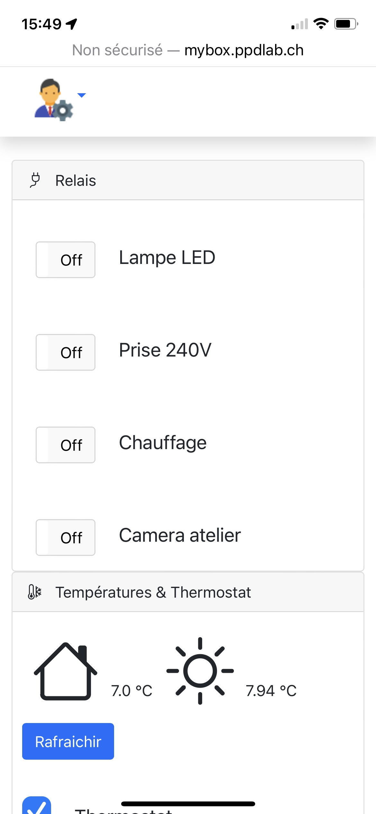
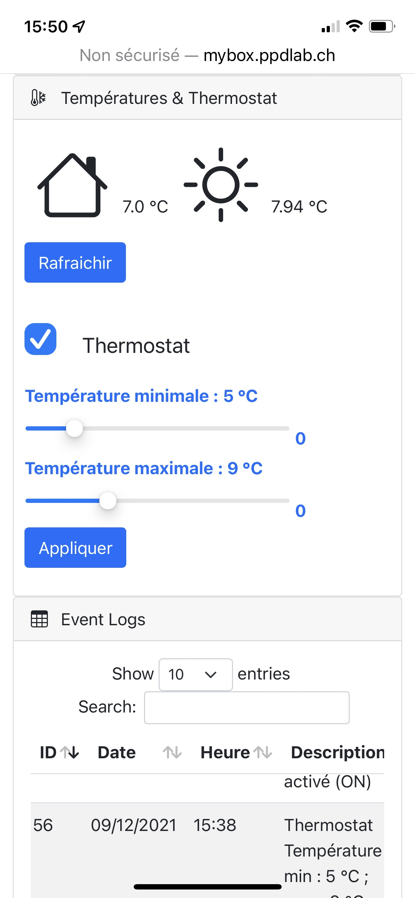
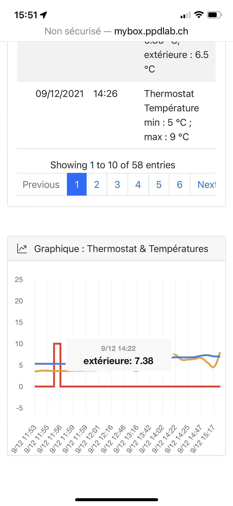
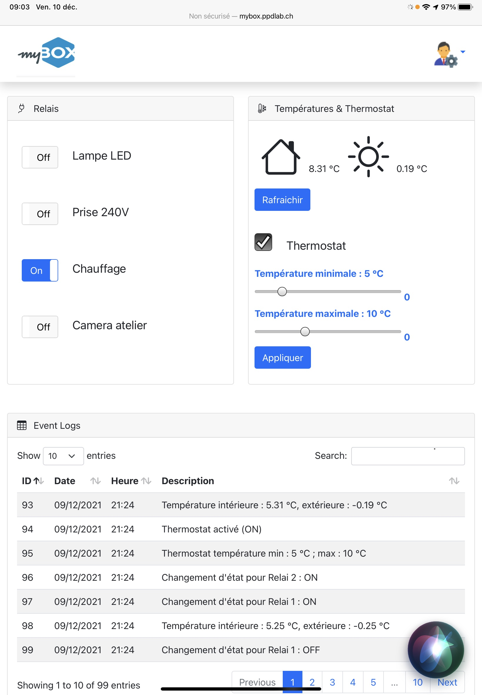
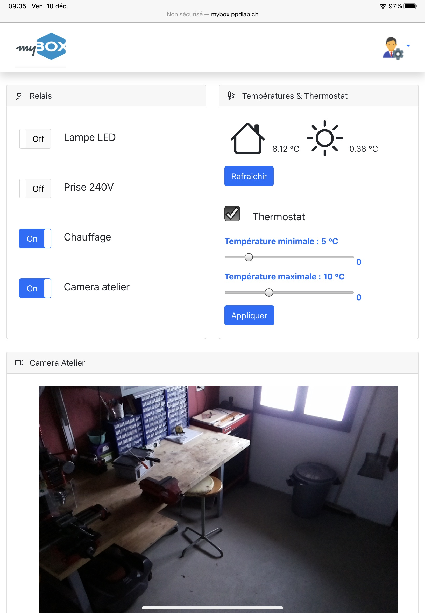
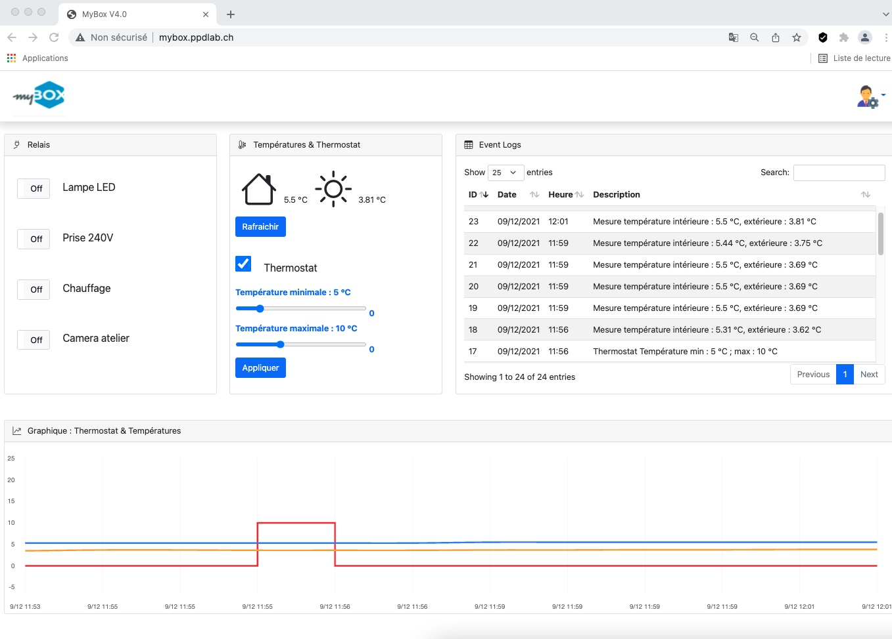
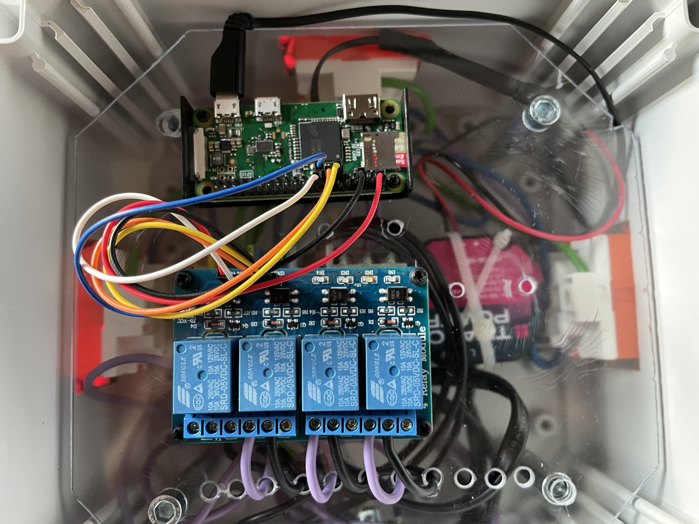

# MyBox

Ce projet consiste à regrouper différentes technologies pour piloter un boitier comprenant 4 relais 240V, 2 sondes de températures DS18B20 grâce à une application web simple en utilisant Flask, Bootstrap et un peu d'Ajax et Javascript sur un Raspberry Pi zero.

## Module 4x relais 240V
Boitier avec 4 prises 240V connectés via GPIO sur Raspberry pi zero.

### PIN Board vs GPIO Details :

| Relays  | BOARD  | GPIO |
|---------|--------|------|
| Relay 1 |     11 |  17  |
| Relay 2 |     13 |  27  |
| Relay 3 |     15 |  22  |
| Relay 4 |     16 |  23  |

## Interface Web

Depuis un smartphone :

Depuis un iPAD :

Depuis un PC :

## Boitier
Le boitier est construit en séparant la partie électrique 240V de la commande (Raspberry Pi zero et module relais) au maximum.

## Code
Le code comprend une partie "back-end" écrite en python3 avec Flask, Threading, GPIO, pickle et logging.

Une partie "front-end" est écrite en HTML5, bootstrap, Ajax et Javascript en reprenant des librairies Javascript bien connues comme Chart, dataTables ou bootstrap.

